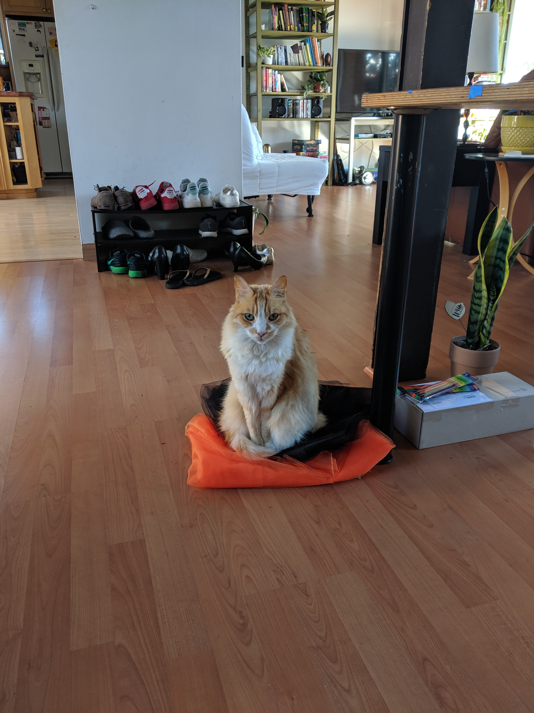
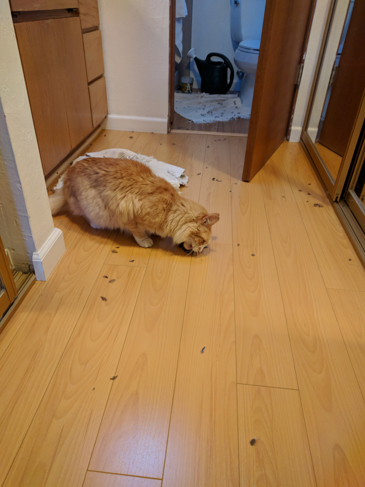
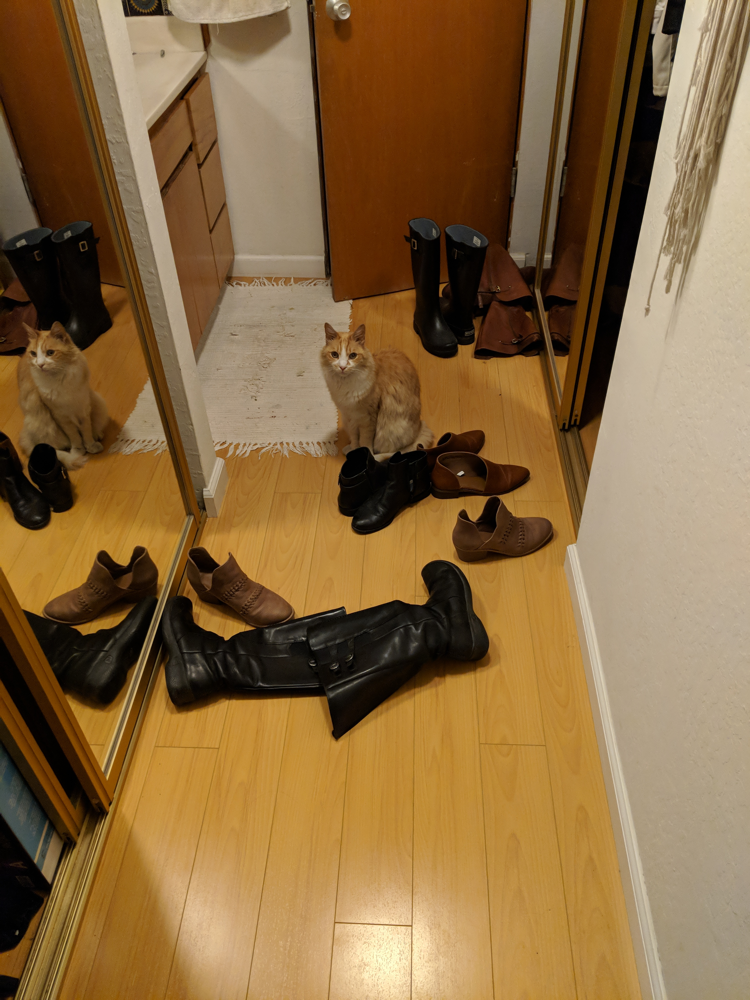
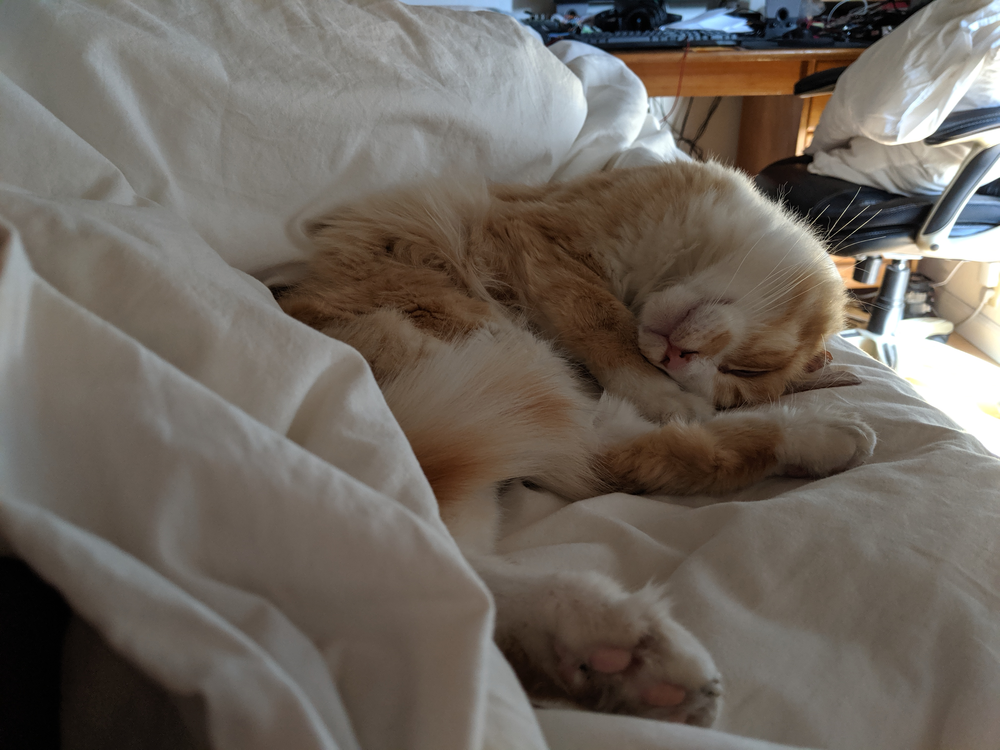

# cat_door
Cat door project which recognized which cat (or anything) approaches the door

run with:
python3 tf_door.py --graph optimized_graph_25_224.pb --labels retrained_labels

Python3 running on Raspberry Pi, significant libraries:
- Tensorflow, image classification
- OpenCV, image augmentation and display for debug
	- Big thanks to Adrian Rosebrock for prividing excellent instructions for install OpenCV on a RPi, tutorial here:
		https://www.pyimagesearch.com/2017/09/04/raspbian-stretch-install-opencv-3-python-on-your-raspberry-pi/

To run program a trained model and corresponding labels file must be provided

Basic opperation:

Idle view during day, almost identical to moving average

Subject enters field of view

Moving average starts to change

Delta of latest image and moving average

After high certainty prediction, gif created and tweeted

- When the PIR motion sensor activates, software senses the activation on a GPIO
- Software continually captures images and compares sequencial images to sense motion
- Since camera sensing element is wider than it is tall, software compares images to tell if motion occured on left side, right side, or center
- When both the PIR sensor and image based motion sense indicate there is some motion in front of the door:
	- Software creates square image from Left, Center, or Right of frame, using 224x224, camera initialized using 224 as height and width propertional to camera aspect ratio
	- Software takes the latest square image capture and inputs it into the trained convolutional neural network
- Software saves classified image in log directory with predicted label, probability, and position in frame of motion

In practice on RPi 3B+:
- Image classification takes about 1 second, depending on model complexity, in this case I used mobilenet_0.25_224
	- When retraining often validation score gets to or approches 100%
- When idling (capturing images to compare and sensing PIR every 0.5secs) CPU runs at ~8%, running raspbian 9, stretch
- After retraining twice with a total of about 300 images model almost always correct, when choosing between 3 different labels, two cats and unknown
- Can retrain model on RPi, takes a few minutes, but obviously much faster on a standard PC
- Can get a lot of false motion activations, when sunlight is shining through trees and wind blows, PIR activates, and as auto brightness of camera operates image based motion sense activates
- Camera is IR sensative so it can operate at night, so the sunlight can be intense at certain time of day but it is still able to see and classify correctly when cats approach

TODO:
- Add power supply current sense
- Run on headless linux to compare power usage
- Add mean and std deviation normalization to image classification, currently using default values not derived from training set
- Try less complex CNN and see if accuracy acceptable, would deliver faster classification times
