# cat_door
Cat door project which recognized which cat (or anything) approaches the door

Basic operation:

When the camera detects motion in the field of view it will capture a picture and input it into a trained TensorFlow model which will classify the image.
The output is used in multiple ways. One use is if the classification is some sort of pest, such as a raccoon or any neighbor cat which the model has trained on, there is a speaker and NeoPixel LEDs which can be activated to scare them from coming inside.
If the classification is anything of interest, (not 'unknown') and above some threshold probability, a gif of the event will be tweeted. There is a separate thread which maintains a series of pictures which can be used to create a gif.

The Python code runs on a Raspberry Pi 4 with 2GB of RAM. It was difficult to stop all the memory leaks and after a few weeks it would crash, however that appears to be resolved and it can run for months now.
On the RPi 4 classification takes about 0.5 seconds with an input image of 244x244 color, and Mobilenet 1.0 model. When first starting the project, I was under the impression that the model input must be a square image, I now know that is not the case, it can be any shape.
However I had already setup the code to detect if the area of interest was on the left, center or right of image, then crop that portion of the image for the classifier. I left that functionality because it does actually save some processing to reduce the input image for 304x224 to 224x224.

The camera is placed right above the door and has a fisheye lens to capture any door traffic. Software maintains a moving average image and compares it to the latest image to detect movement.
Below is a typical view from the door during the day:

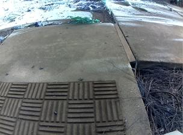

As the subject enters the field of view the total sum delta from the moving average exceeds some threshold and an image is captured.

Below is an image of my cat and the delta image as he approaches the door:

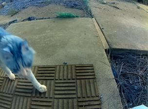 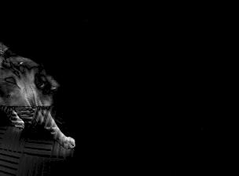

The Camera is IR sensitive and has IR LEDS so works at night as well, the model was trained with both night and day images:

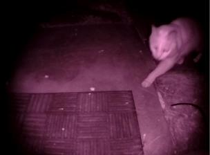 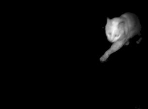

The model has not been trained on squirrels, so it does not really know what to make of them.
Usually labels as unknown or my cat with a low probability. All the images taken when motion is captured are logged to the RPi so periodically I sort all the data and retrain a new model.

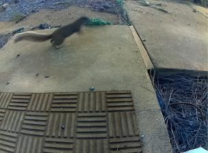 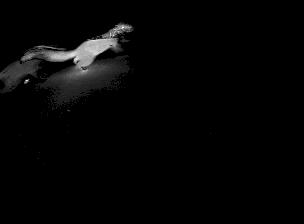

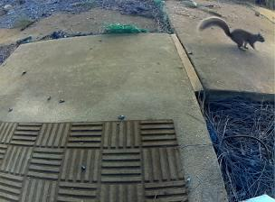 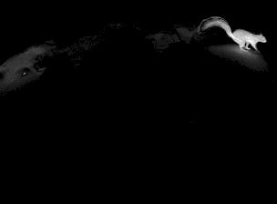

If the classification is not unknown and above 90% probability, the series of images are turned into a gif and tweeted.

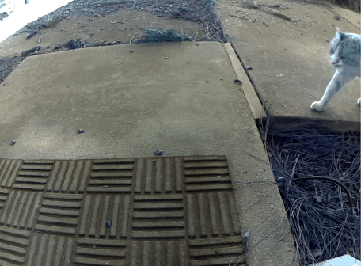 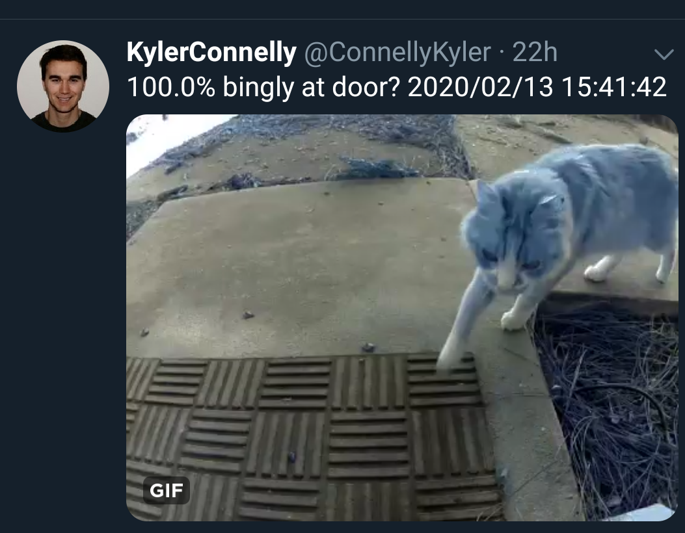
